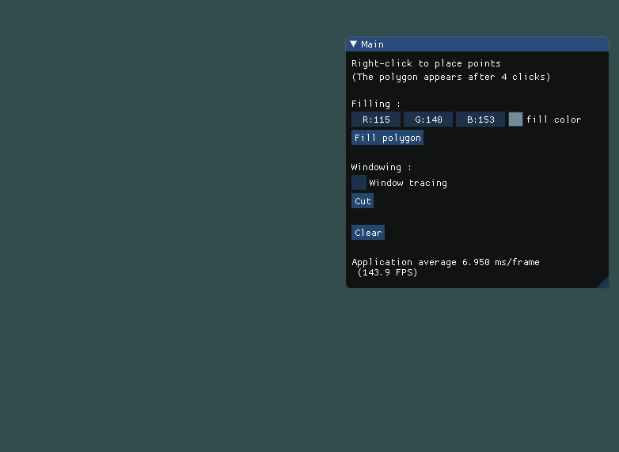

# fenetrage-remplissage-polygones

## Features : 
- Draw polygon (4 points min - White)
- Draw clip window (4 points min - Red)
- Clip (SutherlandHodgman)
- Change fill color
- Scan line alogorthim (SLA)
- Clear viewport

## Developer 

- Dorian GACON - Scan Line Algorithm (SLA)
- Clément CLERC - OpenGL 
- Ronan DHERSIGNERIE - SutherlandHodgman

## Demo
### Clipping 

## Usefull links

### Imgui
[Imgui repo](https://github.com/ocornut/imgui)

[Imgui Get started](https://www.youtube.com/watch?v=nVaQuNXueFw)

### OpenGL
[Mouse coordinate](https://stackoverflow.com/questions/45130391/opengl-get-cursor-coordinate-on-mouse-click-in-c)

[Draw polygon](https://www.youtube.com/watch?v=OsemcM2cvzI)
